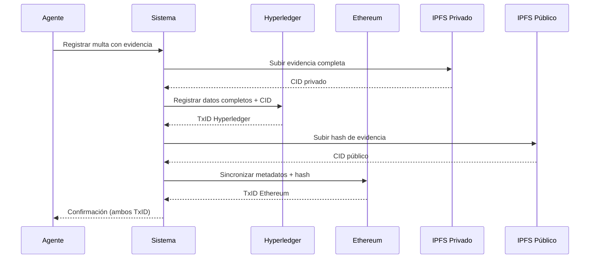
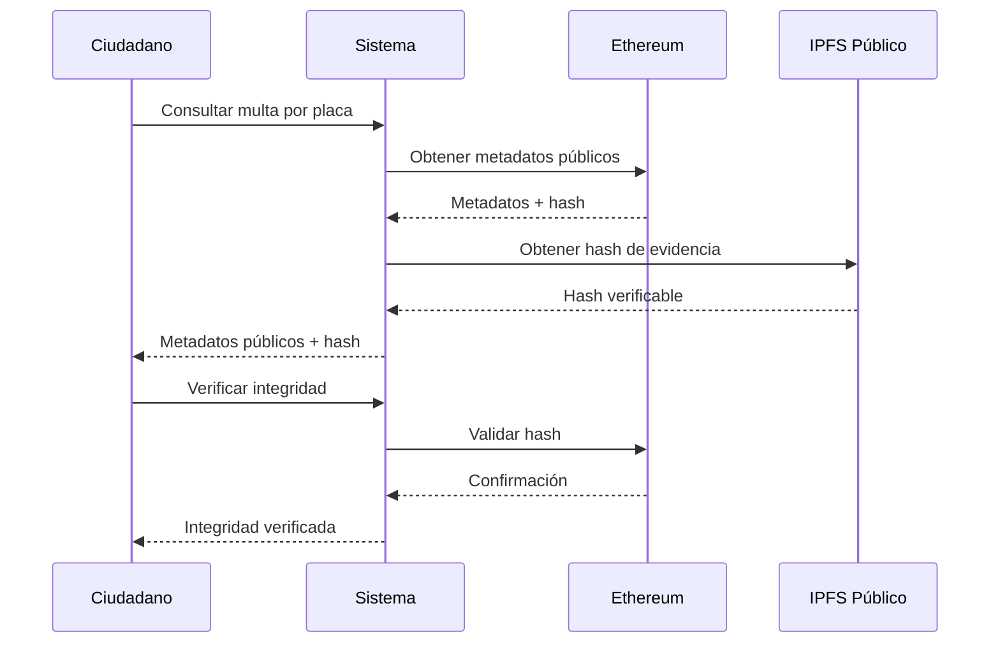
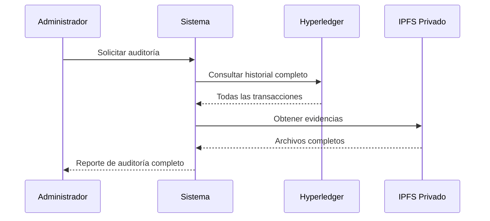

# 🔧 Mejoras al Diagrama de Casos de Uso - Arquitectura Híbrida

## 📋 Estado Actual del Diagrama

**Archivo**: `Images/CasosUso.png`

### Análisis del Diagrama Actual:

**✅ Aspectos Correctos**:
- Actores bien definidos (Administrador, Agente de tránsito, Propietario del vehículo)
- Casos de uso básicos identificados
- Relaciones include/extend correctas
- Autenticación como caso base

**❌ Aspectos a Mejorar**:
1. **Falta distinción entre operaciones privadas (Hyperledger) y públicas (Ethereum)**
2. **No se muestra el flujo de sincronización entre blockchains**
3. **Faltan casos de uso de verificación pública**
4. **No se refleja la arquitectura híbrida**

## 🎯 Mejoras Requeridas

### **IMPORTANTE**: ⚠️ Esta imagen debe ser actualizada para reflejar la arquitectura híbrida y los nuevos casos de uso.

## 🏗️ Diagrama Propuesto - Casos de Uso Híbridos

```mermaid
graph TB
    subgraph "Sistema de Gestión de Foto Multas - Arquitectura Híbrida"
        
        %% Casos de Uso de Autenticación
        Auth["Autenticar usuario"]
        
        %% Casos de Uso del Administrador
        GestionAgentes["Gestionar agentes"]
        GestionConfig["Gestionar configuración"]
        VerStats["Ver estadísticas"]
        AuditInterna["Auditoría interna<br/>(Hyperledger)"]
        GestionPermisos["Gestionar permisos<br/>(Hyperledger)"]
        
        %% Casos de Uso del Agente
        RegistrarMulta["Registrar multa<br/>(Hyperledger + Ethereum)"]
        ActualizarEstado["Actualizar estado de multa<br/>(Hyperledger + Ethereum)"]
        RevisarApelacion["Revisar apelación<br/>(Hyperledger)"]
        VerDetalleMulta["Ver detalles de multa<br/>(Hyperledger)"]
        
        %% Casos de Uso del Propietario
        ConsultarMultas["Consultar multas<br/>(Ethereum - Público)"]
        ApelarMulta["Apelar multa<br/>(Hyperledger)"]
        VerEstadoApelacion["Ver estado de apelación<br/>(Hyperledger)"]
        VerificarIntegridad["Verificar integridad<br/>(Ethereum - Público)"]
        
        %% Casos de Uso del Ciudadano
        ConsultaPublica["Consulta pública<br/>(Ethereum)"]
        VerificarEvEvidencia["Verificar evidencia<br/>(IPFS Público)"]
        
        %% Casos de Uso del Sistema
        SubirIPFS["Subir evidencia a IPFS"]
        RegistrarBlockchain["Registrar en blockchain"]
        SincronizarDatos["Sincronizar datos<br/>(Hyperledger → Ethereum)"]
        ValidarIntegridad["Validar integridad<br/>entre blockchains"]
        NotificarCambios["Notificar cambios"]
        
        %% Relaciones include
        RegistrarMulta -.->|include| Auth
        RegistrarMulta -.->|include| SubirIPFS
        RegistrarMulta -.->|include| RegistrarBlockchain
        RegistrarMulta -.->|include| SincronizarDatos
        
        ActualizarEstado -.->|include| Auth
        ActualizarEstado -.->|include| RegistrarBlockchain
        ActualizarEstado -.->|include| SincronizarDatos
        ActualizarEstado -.->|include| NotificarCambios
        
        RevisarApelacion -.->|include| Auth
        RevisarApelacion -.->|include| ActualizarEstado
        
        ConsultarMultas -.->|include| Auth
        ApelarMulta -.->|include| Auth
        ApelarMulta -.->|include| RegistrarBlockchain
        
        VerificarIntegridad -.->|include| ValidarIntegridad
        ConsultaPublica -.->|include| VerificarIntegridad
        
        GestionAgentes -.->|include| Auth
        GestionConfig -.->|include| Auth
        VerStats -.->|include| Auth
        AuditInterna -.->|include| Auth
        GestionPermisos -.->|include| Auth
        
        %% Relaciones extend
        VerDetalleMulta -.->|extend| ConsultarMultas
        VerEstadoApelacion -.->|extend| ApelarMulta
        VerificarEvEvidencia -.->|extend| ConsultaPublica
    end
    
    %% Actores
    Admin((Administrador))
    Agente((Agente de<br/>tránsito))
    Propietario((Propietario del<br/>vehículo))
    Ciudadano((Ciudadano))
    
    %% Conexiones de Actores
    Admin --> GestionAgentes
    Admin --> GestionConfig
    Admin --> VerStats
    Admin --> AuditInterna
    Admin --> GestionPermisos
    
    Agente --> RegistrarMulta
    Agente --> ActualizarEstado
    Agente --> RevisarApelacion
    Agente --> VerDetalleMulta
    
    Propietario --> ConsultarMultas
    Propietario --> ApelarMulta
    Propietario --> VerEstadoApelacion
    Propietario --> VerificarIntegridad
    
    Ciudadano --> ConsultaPublica
    Ciudadano --> VerificarEvEvidencia
    
    %% Estilos
    style Auth fill:#ffd700
    style RegistrarMulta fill:#90EE90
    style ActualizarEstado fill:#90EE90
    style SincronizarDatos fill:#FF6B6B
    style ValidarIntegridad fill:#FF6B6B
    style ConsultaPublica fill:#87CEEB
    style VerificarIntegridad fill:#87CEEB
    style AuditInterna fill:#DDA0DD
    style GestionPermisos fill:#DDA0DD
```

## 📝 Nuevos Casos de Uso

### **1. Operaciones Privadas (Hyperledger Fabric)**

| Caso de Uso | Actor | Descripción | Flujo |
|------------|-------|-------------|-------|
| **Gestionar permisos** | Administrador | Configurar permisos de usuarios y roles | 1. Autenticar 2. Seleccionar usuario 3. Asignar permisos 4. Registrar en Hyperledger |
| **Auditoría interna** | Administrador | Revisar historial completo de operaciones | 1. Autenticar 2. Seleccionar período 3. Consultar Hyperledger 4. Generar reporte |
| **Revisar apelación** | Agente | Evaluar y resolver apelaciones | 1. Autenticar 2. Ver apelación 3. Evaluar evidencias 4. Actualizar estado 5. Sincronizar a Ethereum |
| **Apelar multa** | Propietario | Presentar apelación con evidencias | 1. Autenticar 2. Cargar evidencias 3. Registrar en Hyperledger 4. Notificar agente |

### **2. Operaciones Públicas (Ethereum)**

| Caso de Uso | Actor | Descripción | Flujo |
|------------|-------|-------------|-------|
| **Consulta pública** | Ciudadano | Consultar multas por placa (solo metadatos) | 1. Ingresar placa 2. Consultar Ethereum 3. Mostrar metadatos públicos |
| **Verificar integridad** | Propietario/Ciudadano | Validar que los datos no han sido alterados | 1. Consultar hash en Ethereum 2. Comparar con datos originales 3. Mostrar resultado |
| **Verificar evidencia** | Ciudadano | Validar hash de evidencia pública | 1. Obtener CID de IPFS público 2. Comparar hash 3. Confirmar autenticidad |

### **3. Operaciones Híbridas (Requieren Sincronización)**

| Caso de Uso | Actor | Descripción | Blockchains Involucradas |
|------------|-------|-------------|-------------------------|
| **Registrar multa** | Agente | Registro completo en Hyperledger, metadatos en Ethereum | Hyperledger (completo) → Ethereum (público) |
| **Actualizar estado** | Agente | Actualizar estado en ambas blockchains | Hyperledger → Ethereum |
| **Consultar multas** | Propietario | Consultar datos completos (autenticado) | Hyperledger (datos completos) |

## 🔄 Flujos de Datos Detallados

### **Flujo 1: Registrar Multa (Híbrido)**

### **Flujo 2: Consulta Pública (Ethereum)**

### **Flujo 3: Auditoría Interna (Hyperledger)**

## 📊 Matriz de Acceso por Actor

| Actor | Hyperledger (Privado) | Ethereum (Público) | IPFS Privado | IPFS Público |
|-------|----------------------|-------------------|--------------|--------------|
| **Administrador** | ✅ Lectura/Escritura | ✅ Solo Lectura | ✅ Lectura/Escritura | ✅ Solo Lectura |
| **Agente de Tránsito** | ✅ Lectura/Escritura | ✅ Solo Lectura | ✅ Lectura/Escritura | ✅ Solo Lectura |
| **Propietario** | ✅ Solo Lectura (sus datos) | ✅ Solo Lectura | ❌ No acceso | ✅ Solo Lectura |
| **Ciudadano** | ❌ No acceso | ✅ Solo Lectura | ❌ No acceso | ✅ Solo Lectura |

## 🎨 Leyenda de Colores para el Diagrama

- **🟡 Amarillo** (#ffd700): Autenticación (caso base)
- **🟢 Verde** (#90EE90): Operaciones privadas (Hyperledger)
- **🔴 Rojo** (#FF6B6B): Operaciones de sincronización
- **🔵 Azul** (#87CEEB): Operaciones públicas (Ethereum)
- **🟣 Púrpura** (#DDA0DD): Operaciones administrativas

## ✅ Checklist para Actualizar el Diagrama

- [ ] Agregar nuevo actor "Ciudadano" para consultas públicas
- [ ] Etiquetar casos de uso con la blockchain correspondiente
- [ ] Agregar casos de uso de sincronización
- [ ] Incluir casos de uso de verificación de integridad
- [ ] Separar visualmente operaciones privadas vs públicas
- [ ] Agregar casos de uso de gestión de permisos
- [ ] Incluir casos de uso de auditoría interna
- [ ] Actualizar relaciones include/extend
- [ ] Agregar leyenda de colores
- [ ] Actualizar título: "Casos de Uso - Sistema Híbrido"

## 📌 Diferencias Clave: Antes vs Después

### **Antes (Arquitectura Simple)**
- Todos los casos de uso en una sola blockchain
- No diferenciación entre operaciones privadas y públicas
- Sin casos de uso de sincronización
- Sin verificación pública de integridad

### **Después (Arquitectura Híbrida)**
- Casos de uso separados por blockchain
- Operaciones privadas en Hyperledger
- Operaciones públicas en Ethereum
- Sincronización entre blockchains
- Verificación pública de integridad
- Control de acceso granular por actor

## 🔐 Consideraciones de Seguridad

1. **Privacidad**: Datos sensibles solo en Hyperledger
2. **Transparencia**: Metadatos públicos en Ethereum
3. **Integridad**: Verificación cruzada entre blockchains
4. **Control de Acceso**: Permisos granulares por rol
5. **Auditoría**: Trazabilidad completa en Hyperledger

---

**⚠️ ACCIÓN REQUERIDA**: Actualizar diagrama de casos de uso para reflejar la arquitectura híbrida y reemplazar `Images/CasosUso.png`
