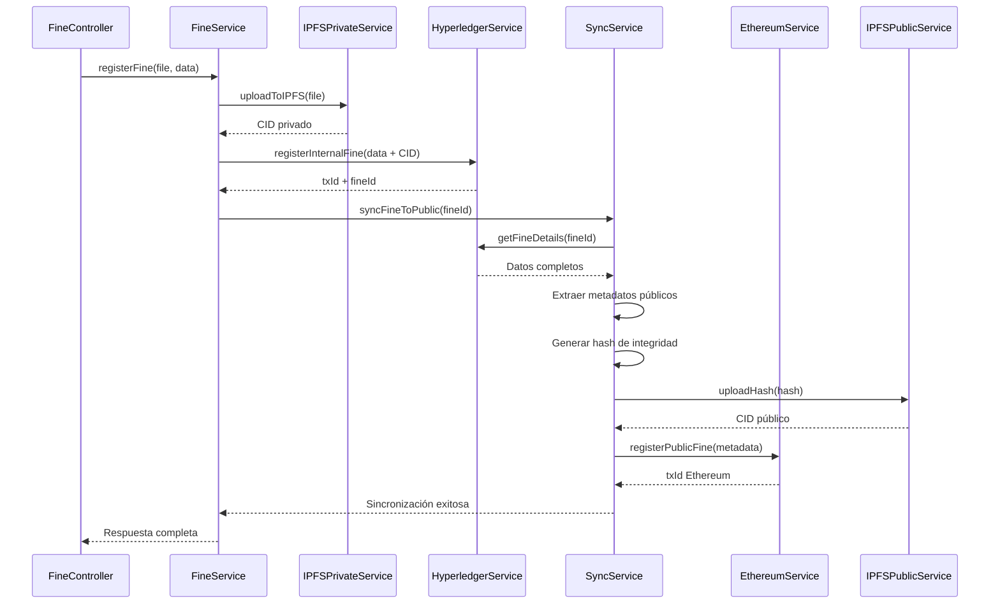
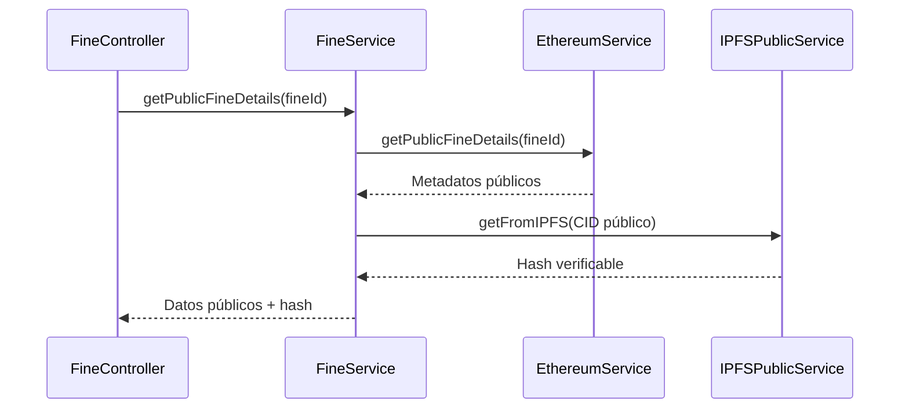
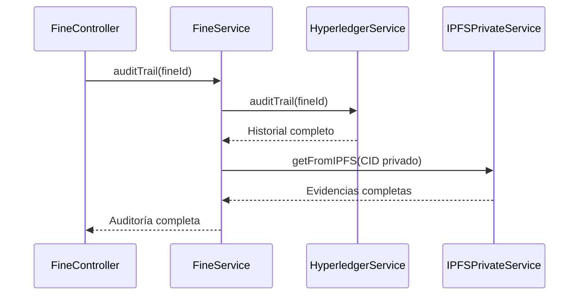

# 🔧 Mejoras al Diagrama de Clases - Arquitectura Híbrida

## 📋 Estado Actual del Diagrama

**Archivo**: `Images/uml.png` y `Images/uml2.png`

### Análisis del Diagrama Actual:

**✅ Aspectos Correctos**:
- Patrón Controller-Service-Repository bien definido
- Interfaces claramente especificadas
- Separación de responsabilidades
- FineService como orquestador central

**❌ Aspectos a Mejorar**:
1. **BlockchainService genérico**: No diferencia entre Hyperledger y Ethereum
2. **Falta HyperledgerService**: No existe servicio específico para Hyperledger Fabric
3. **Sin SyncService**: No hay servicio de sincronización entre blockchains
4. **IPFSService único**: No diferencia entre IPFS privado y público
5. **BlockchainRepository único**: Debería separarse en dos repositorios
6. **Falta gestión de permisos**: No hay clases para control de acceso

## 🎯 Mejoras Requeridas

### **IMPORTANTE**: ⚠️ Estas imágenes deben ser reemplazadas con el nuevo diagrama que refleje la arquitectura híbrida.

## 🏗️ Diagrama Propuesto - Arquitectura de Clases Híbrida

```mermaid
classDiagram
    %% Interfaces principales
    class IFineDetails {
        <<interface>>
        +id: string
        +plateNumber: string
        +evidenceCID: string
        +location: string
        +timestamp: string
        +infractionType: string
        +cost: string
        +ownerIdentifier: string
        +currentState: string
        +registeredBy: string
        +externalSystemId: string
        +hashImageIPFS: string
    }

    class IInternalFineData {
        <<interface>>
        +id: string
        +plateNumber: string
        +evidenceCID: string
        +location: string
        +infractionType: string
        +cost: number
        +ownerIdentifier: string
        +currentState: FineStatus
        +registeredBy: string
        +driverDetails: DriverDetails
        +internalNotes: string
        +appealHistory: AppealEntry[]
    }

    class IPublicFineMetadata {
        <<interface>>
        +fineId: string
        +plateNumber: string
        +evidenceHash: string
        +location: string
        +infractionType: string
        +cost: number
        +timestamp: number
        +status: FineStatus
        +integrityHash: string
    }

    class IFineStatusUpdate {
        <<interface>>
        +lastUpdatedTimestamp: string
        +oldState: number
        +newState: number
        +reason: string
        +updatedBy: string
    }

    %% Controladores
    class FineController {
        -fineService: FineService
        +registerFine(req, res, next): Promise~void~
        +updateFineStatus(req, res, next): Promise~void~
        +getFine(req, res, next): Promise~void~
        +getFines(req, res, next): Promise~void~
        +getFineEvidence(req, res, next): Promise~void~
        +verifyBlockchainIntegrity(req, res, next): Promise~void~
        +getFinesByPlate(req, res, next): Promise~void~
        +getFineStatusHistory(req, res, next): Promise~void~
        +getRecentFinesHistory(req, res, next): Promise~void~
    }

    %% Servicios principales
    class FineService {
        -hyperledgerService: HyperledgerService
        -ethereumService: EthereumService
        -ipfsPrivateService: IPFSPrivateService
        -ipfsPublicService: IPFSPublicService
        -syncService: SyncService
        -aptitudeService: AptitudeService
        +registerFine(file, fineData): Promise~object~
        +updateFineStatus(fineId, newState, reason): Promise~object~
        +getFineDetails(fineId): Promise~IInternalFineData~
        +getAllFines(page, pageSize): Promise~IFineDetails[]~
        +getFineEvidence(evidenceCID): Promise~Uint8Array[]~
        +verifyBlockchainIntegrity(fineId): Promise~object~
        +getFinesByPlate(plateNumber): Promise~IFineDetails[]~
        +getFineStatusHistory(fineId): Promise~IFineStatusUpdate[]~
    }

    class HyperledgerService {
        -static instance: HyperledgerService
        -repository: HyperledgerRepository
        +getInstance(): HyperledgerService
        +registerInternalFine(fineData): Promise~object~
        +updateFineStatus(fineId, newState, reason): Promise~object~
        +getFineDetails(fineId): Promise~IInternalFineData~
        +getFinesDetails(page, pageSize): Promise~IInternalFineData[]~
        +processAppeal(appealData): Promise~string~
        +getUserPermissions(userId): Promise~Permission[]~
        +auditTrail(fineId): Promise~AuditEntry[]~
    }

    class EthereumService {
        -static instance: EthereumService
        -repository: EthereumRepository
        +getInstance(): EthereumService
        +registerPublicFine(metadata): Promise~object~
        +updatePublicStatus(fineId, newState): Promise~object~
        +getPublicFineDetails(fineId): Promise~IPublicFineMetadata~
        +verifyFineIntegrity(fineId): Promise~IntegrityResult~
        +citizenQuery(plateNumber): Promise~IPublicFineMetadata[]~
        +getFinesByPlate(plateNumber): Promise~string[]~
    }

    class SyncService {
        -static instance: SyncService
        -hyperledgerService: HyperledgerService
        -ethereumService: EthereumService
        -logger: HybridLogger
        +getInstance(): SyncService
        +syncFineToPublic(fineId): Promise~void~
        +syncStatusUpdate(fineId, status): Promise~void~
        +verifyDataConsistency(fineId): Promise~ConsistencyResult~
        +resyncFine(fineId): Promise~void~
    }

    class IPFSPrivateService {
        -static instance: IPFSPrivateService
        -repository: IPFSPrivateRepository
        +getInstance(): IPFSPrivateService
        +initialize(): Promise~void~
        +isConnected(): Promise~boolean~
        +uploadToIPFS(fileBuffer, fileName): Promise~string~
        +getFromIPFS(cid): Promise~Uint8Array[]~
    }

    class IPFSPublicService {
        -static instance: IPFSPublicService
        -repository: IPFSPublicRepository
        +getInstance(): IPFSPublicService
        +initialize(): Promise~void~
        +isConnected(): Promise~boolean~
        +uploadHash(hash): Promise~string~
        +getFromIPFS(cid): Promise~Uint8Array[]~
    }

    class AptitudeService {
        -static instance: AptitudeService
        +getInstance(): AptitudeService
        +fetchFineFromAptitude(plateNumber, date): Promise~AptitudeFineData~
    }

    %% Repositorios
    class HyperledgerRepository {
        -static instance: HyperledgerRepository
        -fabricClient: FabricClient
        -channel: Channel
        -chaincode: Contract
        +getInstance(): HyperledgerRepository
        +initialize(): Promise~void~
        +registerFine(fineData): Promise~object~
        +updateFineStatus(fineId, newState, reason): Promise~object~
        +getFineDetails(fineId): Promise~IInternalFineData~
        +getFinesDetails(page, pageSize): Promise~IInternalFineData[]~
        +getFinesByPlate(plateNumber): Promise~string[]~
        +processAppeal(appealData): Promise~string~
    }

    class EthereumRepository {
        -static instance: EthereumRepository
        -provider: JsonRpcProvider
        -wallet: Wallet
        -contract: Contract
        +getInstance(): EthereumRepository
        +initialize(): Promise~void~
        +registerFine(metadata): Promise~object~
        +updateFineStatus(fineId, newState, reason): Promise~object~
        +getFineDetails(fineId): Promise~IPublicFineMetadata~
        +verifyContract(): Promise~void~
        +getFinesByPlate(plateNumber): Promise~string[]~
        +verifyBlockchainIntegrity(fineId): Promise~object~
    }

    class IPFSPrivateRepository {
        -static instance: IPFSPrivateRepository
        -isInitialized: boolean
        -localNodeUrl: string
        -ipfsClient: any
        +getInstance(): IPFSPrivateRepository
        +initialize(): Promise~void~
        +isConnected(): Promise~boolean~
        +uploadToIPFS(fileBuffer, fileName): Promise~string~
        +getFromIPFS(cid): Promise~Uint8Array[]~
        +getNodeUrl(): string
    }

    class IPFSPublicRepository {
        -static instance: IPFSPublicRepository
        -isInitialized: boolean
        -publicNodeUrl: string
        -ipfsClient: any
        +getInstance(): IPFSPublicRepository
        +initialize(): Promise~void~
        +isConnected(): Promise~boolean~
        +uploadToIPFS(fileBuffer, fileName): Promise~string~
        +getFromIPFS(cid): Promise~Uint8Array[]~
    }

    %% Utilidades y Helpers
    class HybridLogger {
        -static instance: HybridLogger
        -logger: winston.Logger
        +getInstance(): HybridLogger
        +logFineRegistration(fineId, blockchain, txId): void
        +logSyncOperation(fineId, from, to, status): void
        +logError(error, context): void
    }

    class HybridErrorHandler {
        +handleBlockchainError(error, context): AppError
        +handleSyncError(error): AppError
        +handleIPFSError(error): AppError
    }

    class AccessControlMiddleware {
        +checkHyperledgerAccess(req, res, next): Promise~void~
        +checkEthereumAccess(req, res, next): Promise~void~
        +checkAdminAccess(req, res, next): Promise~void~
    }

    class ServiceFactory {
        -static hyperledgerService: HyperledgerService
        -static ethereumService: EthereumService
        -static syncService: SyncService
        +getHyperledgerService(): HyperledgerService
        +getEthereumService(): EthereumService
        +getSyncService(): SyncService
    }

    %% Relaciones entre clases
    FineController --> FineService
    
    FineService --> HyperledgerService
    FineService --> EthereumService
    FineService --> SyncService
    FineService --> IPFSPrivateService
    FineService --> IPFSPublicService
    FineService --> AptitudeService
    
    HyperledgerService --> HyperledgerRepository
    EthereumService --> EthereumRepository
    
    IPFSPrivateService --> IPFSPrivateRepository
    IPFSPublicService --> IPFSPublicRepository
    
    SyncService --> HyperledgerService
    SyncService --> EthereumService
    SyncService --> HybridLogger
    
    HyperledgerRepository ..|> IInternalFineData
    EthereumRepository ..|> IPublicFineMetadata
    
    ServiceFactory ..> HyperledgerService
    ServiceFactory ..> EthereumService
    ServiceFactory ..> SyncService
```



## 📝 Nuevas Clases y Responsabilidades

### **1. HyperledgerService**
**Responsabilidad**: Gestión de operaciones privadas en Hyperledger Fabric

```typescript
class HyperledgerService {
    // Operaciones privadas
    async registerInternalFine(fineData: IInternalFineData): Promise<{txId: string, fineId: string}>
    async updateFineStatus(fineId: string, newState: FineStatus, reason: string): Promise<{txId: string}>
    async processAppeal(appealData: AppealData): Promise<string>
    
    // Consultas privadas
    async getFineDetails(fineId: string): Promise<IInternalFineData>
    async getFinesDetails(page: number, pageSize: number): Promise<IInternalFineData[]>
    async getUserPermissions(userId: string): Promise<Permission[]>
    
    // Auditoría
    async auditTrail(fineId: string): Promise<AuditEntry[]>
}
```

### **2. EthereumService**
**Responsabilidad**: Gestión de operaciones públicas en Ethereum

```typescript
class EthereumService {
    // Operaciones públicas
    async registerPublicFine(metadata: IPublicFineMetadata): Promise<{txId: string}>
    async updatePublicStatus(fineId: string, newState: FineStatus): Promise<{txId: string}>
    
    // Consultas públicas
    async getPublicFineDetails(fineId: string): Promise<IPublicFineMetadata>
    async citizenQuery(plateNumber: string): Promise<IPublicFineMetadata[]>
    async getFinesByPlate(plateNumber: string): Promise<string[]>
    
    // Verificación
    async verifyFineIntegrity(fineId: string): Promise<IntegrityResult>
}
```

### **3. SyncService**
**Responsabilidad**: Sincronización de datos entre blockchains

```typescript
class SyncService {
    // Sincronización
    async syncFineToPublic(fineId: string): Promise<void>
    async syncStatusUpdate(fineId: string, status: FineStatus): Promise<void>
    async resyncFine(fineId: string): Promise<void>
    
    // Verificación
    async verifyDataConsistency(fineId: string): Promise<ConsistencyResult>
    
    // Proceso:
    // 1. Obtener datos de Hyperledger
    // 2. Extraer metadatos públicos
    // 3. Generar hash de integridad
    // 4. Registrar en Ethereum
    // 5. Validar sincronización exitosa
}
```

### **4. IPFSPrivateService e IPFSPublicService**
**Responsabilidad**: Gestión separada de almacenamiento IPFS

```typescript
class IPFSPrivateService {
    // Almacenamiento privado (evidencias completas)
    async uploadToIPFS(fileBuffer: Buffer, fileName: string): Promise<string>
    async getFromIPFS(cid: string): Promise<Uint8Array[]>
}

class IPFSPublicService {
    // Almacenamiento público (solo hashes)
    async uploadHash(hash: string): Promise<string>
    async getFromIPFS(cid: string): Promise<Uint8Array[]>
}
```

### **5. ServiceFactory**
**Responsabilidad**: Creación y gestión de instancias de servicios

```typescript
class ServiceFactory {
    static getHyperledgerService(): HyperledgerService {
        if (!this.hyperledgerService) {
            this.hyperledgerService = new HyperledgerService();
        }
        return this.hyperledgerService;
    }
    
    static getEthereumService(): EthereumService {
        if (!this.ethereumService) {
            this.ethereumService = new EthereumService();
        }
        return this.ethereumService;
    }
    
    static getSyncService(): SyncService {
        if (!this.syncService) {
            this.syncService = new SyncService(
                this.getHyperledgerService(),
                this.getEthereumService()
            );
        }
        return this.syncService;
    }
}
```

## 🔄 Flujos de Datos entre Clases

### **Flujo 1: Registro de Multa**


### **Flujo 2: Consulta Pública**


### **Flujo 3: Auditoría Interna**


## 📊 Tabla de Responsabilidades por Capa

| Capa | Clase | Responsabilidad Principal | Blockchain |
|------|-------|--------------------------|------------|
| **Controller** | FineController | Manejo de peticiones HTTP | N/A |
| **Service** | FineService | Orquestación de operaciones | Ambas |
| **Service** | HyperledgerService | Operaciones privadas | Hyperledger |
| **Service** | EthereumService | Operaciones públicas | Ethereum |
| **Service** | SyncService | Sincronización | Ambas |
| **Service** | IPFSPrivateService | Almacenamiento privado | Hyperledger |
| **Service** | IPFSPublicService | Almacenamiento público | Ethereum |
| **Repository** | HyperledgerRepository | Acceso a Hyperledger Fabric | Hyperledger |
| **Repository** | EthereumRepository | Acceso a Ethereum | Ethereum |
| **Repository** | IPFSPrivateRepository | Acceso a IPFS privado | Hyperledger |
| **Repository** | IPFSPublicRepository | Acceso a IPFS público | Ethereum |
| **Utility** | ServiceFactory | Creación de instancias | N/A |
| **Utility** | HybridLogger | Logging estructurado | N/A |
| **Utility** | HybridErrorHandler | Manejo de errores | N/A |

## 🔐 Patrones de Diseño Aplicados

### **1. Factory Pattern**
```typescript
// Centraliza la creación de servicios
const hyperledgerService = ServiceFactory.getHyperledgerService();
const ethereumService = ServiceFactory.getEthereumService();
```

### **2. Repository Pattern**
```typescript
// Abstrae el acceso a datos
class HyperledgerRepository {
    async getFineDetails(fineId: string): Promise<IInternalFineData> {
        // Lógica de acceso a Hyperledger Fabric
    }
}
```

### **3. Service Layer Pattern**
```typescript
// Encapsula lógica de negocio
class FineService {
    async registerFine(file, data) {
        // Orquesta múltiples servicios
        const cid = await this.ipfsPrivateService.uploadToIPFS(file);
        const result = await this.hyperledgerService.registerInternalFine({...data, cid});
        await this.syncService.syncFineToPublic(result.fineId);
        return result;
    }
}
```

## ✅ Checklist para Actualizar el Diagrama

- [ ] Separar BlockchainService en HyperledgerService y EthereumService
- [ ] Agregar SyncService con sus dependencias
- [ ] Separar IPFSService en IPFSPrivateService y IPFSPublicService
- [ ] Agregar HyperledgerRepository y EthereumRepository
- [ ] Incluir ServiceFactory para gestión de instancias
- [ ] Agregar HybridLogger para logging estructurado
- [ ] Incluir HybridErrorHandler para manejo de errores
- [ ] Agregar AccessControlMiddleware
- [ ] Actualizar interfaces (IInternalFineData, IPublicFineMetadata)
- [ ] Mostrar relaciones entre nuevas clases
- [ ] Agregar leyenda de colores por tipo de blockchain
- [ ] Actualizar título: "Diagrama de Clases - Arquitectura Híbrida"

## 🎨 Leyenda de Colores Sugerida

- **🟢 Verde**: Clases relacionadas con Hyperledger Fabric
- **🔵 Azul**: Clases relacionadas con Ethereum
- **🟡 Amarillo**: Clases de sincronización (ambas blockchains)
- **⚪ Blanco**: Clases compartidas/utilidades
- **🟣 Púrpura**: Interfaces

---

**⚠️ ACCIÓN REQUERIDA**: Crear nuevo diagrama de clases que refleje la arquitectura híbrida y reemplazar `Images/uml.png` y `Images/uml2.png`
