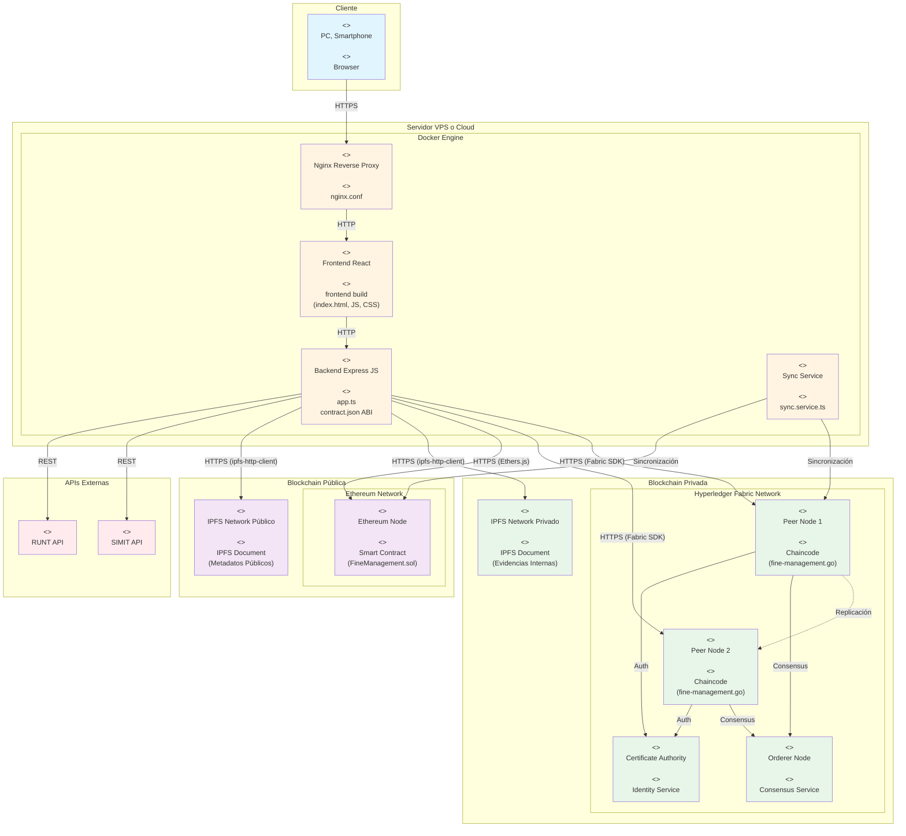

# 🔧 Mejoras al Diagrama de Despliegue - Arquitectura Híbrida

## 📋 Estado Actual del Diagrama

**Archivo**: `Images/Despliegue.png`

### Problemas Identificados:

1. **Solo muestra Ethereum Network**: No refleja la arquitectura híbrida con Hyperledger Fabric
2. **IPFS Network único**: No diferencia entre IPFS privado (Hyperledger) e IPFS público (Ethereum)
3. **Smart Contract único**: No muestra la separación entre chaincode (Hyperledger) y Smart Contracts (Ethereum)
4. **Falta sincronización**: No se ve el servicio de sincronización entre blockchains

## 🎯 Mejoras Requeridas

### **IMPORTANTE**: ⚠️ Esta imagen debe ser reemplazada con el nuevo diagrama que refleje la arquitectura híbrida.

## 🏗️ Diagrama Propuesto - Arquitectura Híbrida



## 📝 Elementos del Nuevo Diagrama

### **1. Blockchain Privada - Hyperledger Fabric**
- **Peer Nodes**: Nodos que mantienen el ledger y ejecutan chaincode
- **Orderer Node**: Nodo que maneja el consenso y ordena las transacciones
- **Certificate Authority**: Gestión de identidades y permisos
- **IPFS Privado**: Almacenamiento de evidencias internas

### **2. Blockchain Pública - Ethereum**
- **Ethereum Node**: Nodo que ejecuta Smart Contracts
- **IPFS Público**: Almacenamiento de metadatos públicos

### **3. Servicio de Sincronización**
- **Sync Service**: Servicio que sincroniza datos entre Hyperledger y Ethereum
- **Responsabilidades**:
  - Sincronizar metadatos de Hyperledger a Ethereum
  - Validar consistencia de datos
  - Mantener integridad entre blockchains

### **4. Flujos de Datos**

#### **Flujo de Registro de Multa**:
1. Frontend → Backend: Solicitud de registro
2. Backend → IPFS Privado: Upload de evidencia completa
3. Backend → Hyperledger: Registro interno completo
4. Sync Service → Ethereum: Sincronización de metadatos públicos
5. Backend → IPFS Público: Hash de evidencia pública

#### **Flujo de Consulta Ciudadana**:
1. Frontend → Backend: Solicitud de consulta
2. Backend → Ethereum: Consulta de metadatos públicos
3. Backend → IPFS Público: Obtención de hash público
4. Backend → Frontend: Respuesta con datos públicos

#### **Flujo de Auditoría Interna**:
1. Frontend → Backend: Solicitud de auditoría
2. Backend → Hyperledger: Consulta de datos completos
3. Backend → IPFS Privado: Obtención de evidencias
4. Backend → Frontend: Respuesta con datos completos

## 🔄 Comparación: Antes vs Después

### **Antes (Arquitectura Simple)**
```
Browser → Nginx → Frontend → Backend
                              ↓
                      Ethereum Network
                              ↓
                        IPFS Network
                              ↓
                          SIMIT API
```

### **Después (Arquitectura Híbrida)**
```
Browser → Nginx → Frontend → Backend → Sync Service
                              ↓               ↓
                    ┌─────────┴──────────┬────┘
                    ↓                    ↓
         Hyperledger Fabric      Ethereum Network
                    ↓                    ↓
            IPFS Privado          IPFS Público
                    ↓
             APIs Externas
```

## 📊 Tabla de Componentes y Responsabilidades

| Componente | Tecnología | Responsabilidad | Datos Almacenados |
|------------|-----------|-----------------|-------------------|
| **Hyperledger Peer** | Fabric v2.5 | Ledger privado | Datos completos de multas, usuarios, permisos |
| **Hyperledger Orderer** | Fabric v2.5 | Consenso PBFT | N/A (servicio) |
| **Hyperledger CA** | Fabric CA | Gestión de identidades | Certificados, permisos |
| **Ethereum Node** | Geth/Hardhat | Ledger público | Metadatos públicos, hashes |
| **IPFS Privado** | Kubo v0.34 | Almacenamiento privado | Evidencias completas, documentos internos |
| **IPFS Público** | Kubo v0.34 | Almacenamiento público | Hashes de evidencias, metadatos verificables |
| **Sync Service** | Node.js | Sincronización | N/A (servicio) |
| **Backend** | Express.js | API REST | N/A (servicio) |

## 🎨 Colores Propuestos para el Diagrama

- **Azul claro** (#e1f5ff): Cliente
- **Amarillo claro** (#fff4e1): Servidor/Docker
- **Verde claro** (#e8f5e9): Hyperledger Fabric + IPFS Privado
- **Púrpura claro** (#f3e5f5): Ethereum + IPFS Público
- **Rojo claro** (#ffebee): APIs Externas

## ✅ Checklist para Actualizar el Diagrama

- [ ] Agregar nodos de Hyperledger Fabric (Peer, Orderer, CA)
- [ ] Separar IPFS en Privado y Público
- [ ] Agregar Servicio de Sincronización
- [ ] Mostrar conexiones entre Backend y ambas blockchains
- [ ] Actualizar leyenda con nuevos componentes
- [ ] Agregar anotaciones para flujos de datos
- [ ] Incluir protocolos de comunicación (Fabric SDK, Ethers.js)
- [ ] Actualizar título: "Arquitectura de Despliegue - Sistema Híbrido"

## 📌 Notas Importantes

1. **Replicación**: Los Peer Nodes de Hyperledger se replican entre sí para mantener consistencia
2. **Consenso**: El Orderer Node coordina el consenso entre peers
3. **Autenticación**: El CA Node gestiona certificados y permisos
4. **Sincronización**: El Sync Service es crítico para mantener coherencia entre blockchains
5. **Privacidad**: Los datos sensibles nunca llegan a Ethereum, solo metadatos públicos

---

**⚠️ ACCIÓN REQUERIDA**: Crear nuevo diagrama de despliegue que refleje esta arquitectura híbrida y reemplazar `Images/Despliegue.png`
